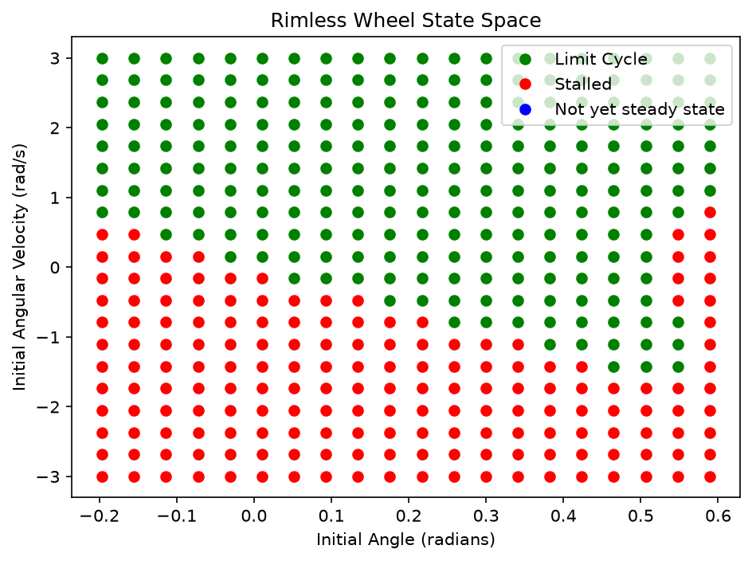
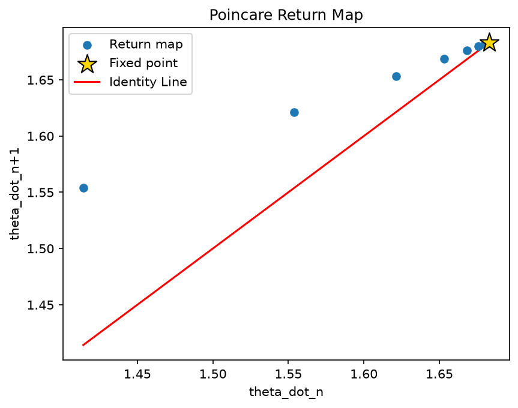
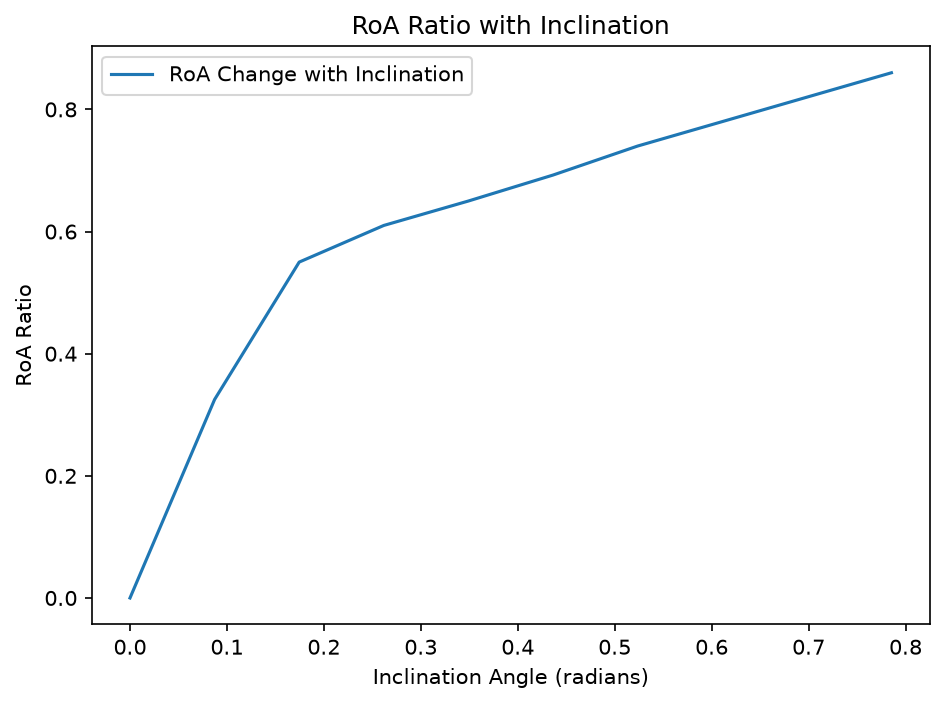
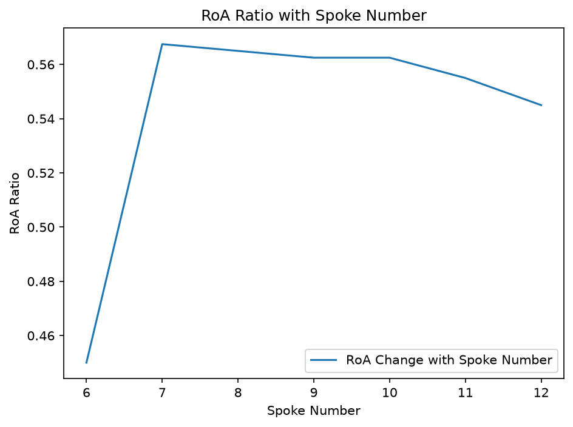
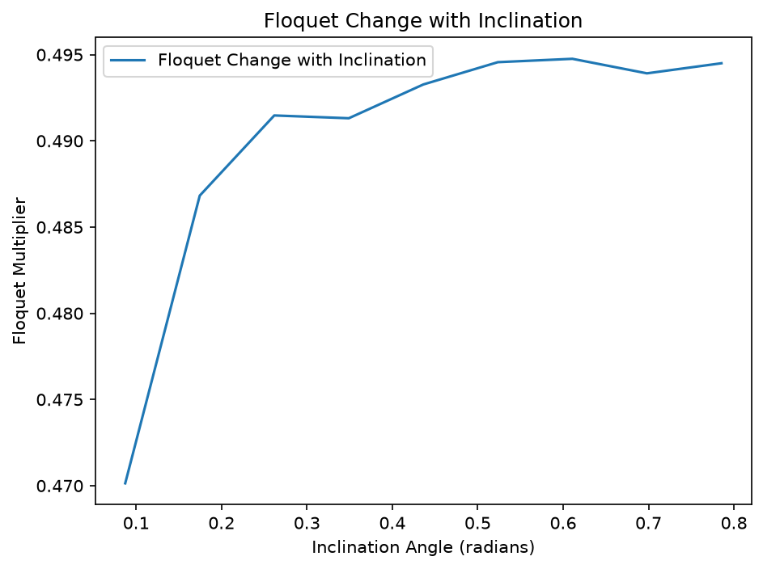
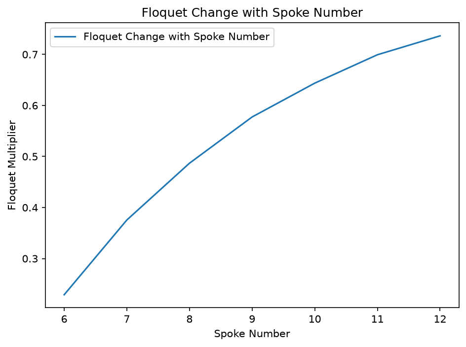

CONTENTS OF MARKDOWN FILE
1. an explanation of your sanity checks, including what you expected and what happened; (5 pts)
2. a state-space plot showing the RoA of every stable attractor, including fixed points and limit cycles; (5 pts)
3. your one-dimensional return-map plot, with its fixed point and the identity line clearly marked; and (5 pts)
4. visualization and discussion of how the slope and number of spokes affects the RoA and local convergence (10 pts)"

ChrisMirandaSoto Explanation:

1. Throughout my code, I conducted several sanity checks at each stage. First, I wrote my code for
the spoke dynamics and made a diagram in my notes of what it should look like. If my code was correct,
I expected that the state trajectory should show an asymmetric plot where the data oscilates between
-alpha + gamma and alpha + gamma, increasing greatly, then sharpily dropping making a sawtooth wave
when spoke switch happened. Also, at initial conditions where I expected it to stall, I expected
to see pendulum behavior where the leg never switches and just oscilates. Other sanity checks include making my
RoA and checking specific initial conditions that were shown to become limit cycles by running them individually
and checking the angular velocity values after spoke switches to see if they truly converged, as well as conceptually evaluating whether my RoA vs and Floquet vs plots made sense, which they did.

2.

3.

4.

As the inclination slope angle increases, the region of attraction ratio grows steadily,
starting at zero on flat ground. On a flat slope, there is no continuing motion and the
wheel simply stalls out, meaning no limit cycles are reached so the RoA ratio is zero.
As the slope angle increases, the stance window shifts further past vertical,
giving gravity a net energy gain each step that can offset the impact losses,
so a growing range of starting conditions successfully settles into the rolling limit cycle.

The region of attraction ratio rises sharply from six to seven spokes, stays fairly high
through about ten spokes, then declines gradually toward twelve spokes. The initial rise
makes sense since with only six spokes, the spacing between them is wide, making
it harder for the leg to swing far enough to cross vertical. The later decline
is not necesarily accurate and might be because with more spokes, it takes longer for
the wheel to settle into steady rolling which if it doesn't settle until after the sim time,
will appear as "Not yet steady state" and will not add to the RoA ratio.

The Floquet multiplier stays roughly constant across all tested slope angles except the flat case.
This makes sense because the energy gravity adds during stance and the energy lost at impact play
different roles in the dynamics. Gravity's contribution depends on slope angle but not on
how fast the wheel is already moving while the impact loss is a fixed percentage of the
current speed, so the slope angle doesn't necessarily affect how quickly the wheel converges
back to steady rolling after a small disturbance.

The Floquet multiplier increases steadily with spoke number, moving from a stronger
attractor (smaller multiplier) at six spokes toward a weaker one (larger multiplier) at twelve spokes.
More spokes means a smaller angle between them, which makes each impact gentler which means less energy
loss so higher floquet multiplier. Since the impact's energy loss is what pulls the wheel's speed back
toward its steady value after a disturbance, a gentler impact means weaker correction and
slower recovery. With infinite spokes, it would essentially become a rimmed wheel with no
energy loss and approach a multiplier of one.
