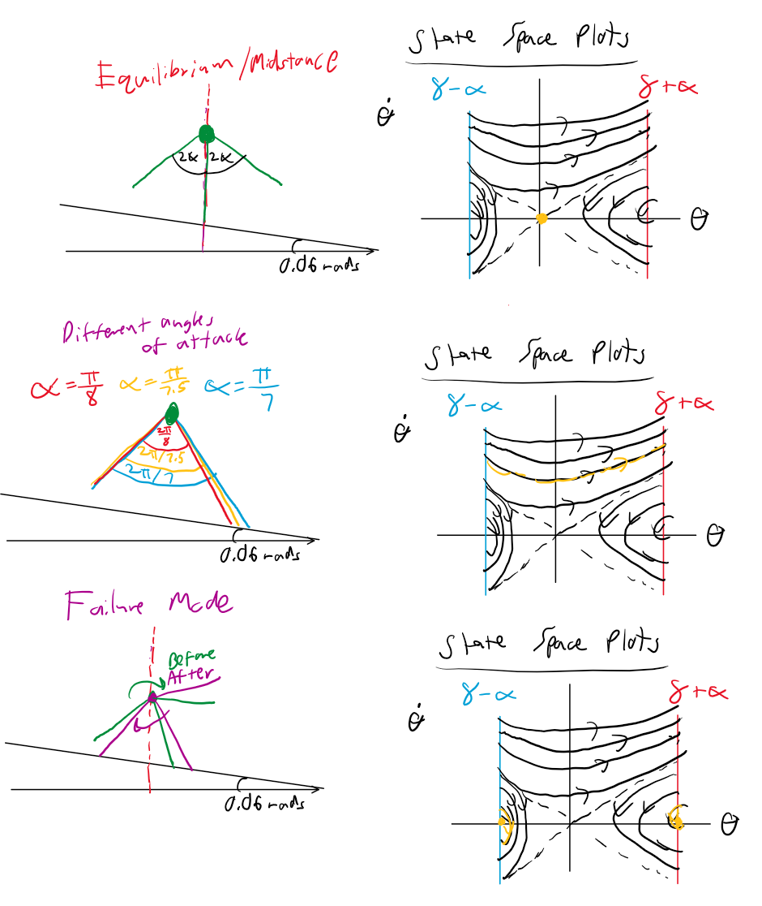

## Model and notation

Point mass $m$ on a massless leg of length $\ell$, pivoting about the stance foot on a slope of
inclination $\gamma$. The angle $\theta$ is measured clockwise from upward vertical, so with an
ankle torque $\tau$ and moment of inertia $I = m\ell^2$ about the foot,

$$\ddot{\theta} = \frac{g}{\ell}\sin\theta + \frac{\tau}{m\ell^2}$$

At touchdown both legs are symmetric about the slope normal, which is itself tilted $\gamma$ from
vertical, so the event guards and impact map are

$$\theta_{TD} = \gamma + \alpha, \qquad \theta^{+} = \gamma - \alpha, \qquad
\dot{\theta}^{+} = \cos(2\alpha)\,\dot{\theta}^{-}$$

Controls: $\tau \in [-0.1\,mg\ell,\ 0.05\,mg\ell]$ every timestep, and
$\alpha \in [\pi/8,\ \pi/7]$ once per step. Parameters: $\gamma = 0.06$ rad, $\ell = 1$ m,
$m = 1$ kg, $g = 9.81$ m/s$^2$.

## 1. Sketches

{ width=90% }

## 2. Region of attraction of the ankle controller

### Controller

Choosing

$$\tau = m\ell^2\,\ddot{\theta}_{des} - mg\ell\sin\theta, \qquad
\ddot{\theta}_{des} = -k_p\,\theta - k_d\,\dot{\theta}$$

cancels the gravity term exactly (feedback linearization) and leaves the closed-loop system

$$\ddot{\theta} + k_d\,\dot{\theta} + k_p\,\theta = 0$$

which is asymptotically stable at $(\theta, \dot{\theta}) = (0,0)$ for any $k_p, k_d > 0$. This is
the "invert gravity and add damping" strategy: one $-\frac{g}{\ell}\sin\theta$ of torque cancels
gravity and a second supplies the restoring term. Comparing with
$\ddot{\theta} + 2\zeta\omega_n\dot{\theta} + \omega_n^2\theta = 0$ gives $k_p = \omega_n^2$ and
$k_d = 2\zeta\omega_n$; I used $\zeta = 1$, i.e. $k_d = 2\sqrt{k_p}$, since critical damping is the
fastest response without overshoot, and overshoot is particularly costly here because the
backward torque bound ($0.05\,mg\ell$) is half the forward one ($0.1\,mg\ell$). Gains used:
$k_p = 28.48$, $k_d = 10.67$.

The commanded torque is clipped to the permissible range. Once it saturates, gravity is no longer
cancelled and the guarantee above fails, so the region of attraction must be found numerically.

### Grid bounds

The RoA is found by simulating the closed loop from every point of a $90 \times 90$ grid and
recording which states settle at upright ($|\theta| < 10^{-3}$ and $|\dot{\theta}| < 10^{-3}$
within 5 s).

* **$\theta$:** the walker is only ever between its own stance walls, so the grid spans
  $\gamma \pm \pi/7 = [-0.389,\ 0.509]$ rad, using the largest permissible $\alpha$ on both sides.
  A run is aborted as a failure when it leaves this interval: backwards means rolling back onto
  the previous foot, forwards means the next foot has already landed.
* **$\dot{\theta}$:** with the ankle off, the states that coast exactly to upright lie on the
  separatrix $\dot{\theta} = -2\sqrt{g/\ell}\,\sin(\theta/2)$, whose magnitude is at most
  $1.2$ rad/s over that $\theta$ range. The bounded torque can only correct small deviations from
  it, so $\dot{\theta} \in [-1.5,\ 1.5]$ rad/s covers the RoA with margin.

A static check supports these bounds: holding the pendulum at rest needs $mg\ell|\sin\theta|$, so
no state with $\theta > \arcsin(0.1) \approx 0.1$ rad or $\theta < -\arcsin(0.05) \approx -0.05$
rad can be held at zero velocity by any permissible torque.

### Result

![Region of attraction of the ankle controller ($90 \times 90$ grid, torque clipped to $[-0.1,\ 0.05]\,mg\ell$).](figures/roa.png){ width=75% }

The RoA is a narrow diagonal band along the separatrix rather than a blob around the origin.
With at most $0.1\,mg\ell$ of torque against a gravitational torque of up to $mg\ell$, the
controller can only rescue states that were already close to coasting to a stop at upright.
Without any torque the set of states reaching upright is just the one-dimensional stable manifold
(the incoming separatrix branches); the bounded torque widens that curve into a band whose width
is set by the torque bounds, not by the gains. Two slices:

* at $\dot{\theta} = 0$: $\theta \in [-0.036,\ 0.105]$ rad, asymmetric because the forward torque
  bound is twice the backward one, and matching the static estimate above;
* at $\theta = 0$: $\dot{\theta} \in [-0.152,\ 0.287]$ rad/s.

### Event guard

The RoA is stored as a boolean array over the grid. The guard converts a state to grid indices
and reports "inside" only if the entire $3 \times 3$ neighbourhood of grid points is inside. This
conservatism matters: with a plain nearest-point lookup, states just outside the true boundary
were admitted, the controller switched on, and the walker fell. The cost is that the usable band
is trimmed by about one cell on each edge, which is why the RoA grid resolution matters as well
(Section 4). While walking, the ankle torque is held at zero; the guard is evaluated every
timestep and the controller is latched on permanently the first time it fires.

{ width=85% }

## 3. Choice of Poincaré section

With $\alpha$ fixed, touchdown is a convenient section because $\theta_{TD}(\gamma,\alpha)$ is
constant. Once $\alpha$ is a control input the touchdown guard moves with the input, so it no
longer defines a fixed surface and a state on it would need both $\dot{\theta}$ and the $\alpha$
used. I therefore use

$$\Sigma = \{(\theta, \dot{\theta}) : \theta = 0,\ \dot{\theta} > 0\}$$

the instant the walker passes upright moving downhill. It satisfies both requirements:

* **Transverse to the relevant flow.** The flow is $(\dot{\theta},\ \ddot{\theta})$; on the line
  $\theta = 0$ the component normal to the line is $\dot{\theta}$, strictly positive on $\Sigma$,
  so orbits cross it and never run along it. Every orbit that completes a step crosses $\theta = 0$
  exactly once. Orbits that stall before upright and roll back never reach it, but those are
  failures, not relevant flow.
* **$\theta$ constant.** Every point of $\Sigma$ has $\theta = 0$, so the section state is the
  single number $\dot{\theta}_k$ and the step-to-step dynamics reduce to the scalar map
  $\dot{\theta}_{k+1} = P(\dot{\theta}_k, \alpha_k)$ with the single input $\alpha_k$.

Two further advantages: $\Sigma$ lies strictly between the stance walls for every permissible
$\alpha$ ($-0.389 < 0 < 0.453$), so switching $\alpha$ on the section never moves a guard the
walker is close to — a stance begins at $\gamma - \alpha_{k}$, crosses $\Sigma$, and ends at
$\gamma + \alpha_{k+1}$ — and the standing equilibrium itself lies on $\Sigma$, so "has the walker
reached the RoA" becomes an interval of speeds on the section.

## 4. Verifying the grid resolution

### Table and policy

The state axis of the lookup table is $\dot{\theta}_k$ from $0$ to $\sqrt{2g/\ell} = 4.43$ rad/s
(Froude number $\mathrm{Fr} = \ell\dot{\theta}^2/g = 2$); the control axis is
$\alpha \in [\pi/8,\ \pi/7]$. Each cell is simulated from $(0, \dot{\theta}_k)$ with the ankle off
until the state enters the RoA, rolls back, or returns to $\Sigma$ with a new speed
$\dot{\theta}_{k+1}$. Backward induction then labels rows already in the RoA as $0$ steps, rows
where some $\alpha$ reaches the RoA as $1$ step, and rows whose landing speed is a $(k-1)$-step row
as $k$ steps. Landing speeds essentially never coincide with a grid row, so they are rounded to the
nearest one — which is exactly the approximation this section has to justify.

### Criterion

A grid is adequate only if the real continuous walker behaves as the table predicts. I ran the
full timestep simulation under the table's policy from 150 randomly drawn starting speeds in
$[0,\ 4.43]$ rad/s — random so that they essentially never coincide with grid rows, and with a
fixed seed so every resolution faces the same test set. A grid passes if:

1. every start reaches standing (no failures);
2. no start takes more steps than the table promised for its nearest row (no "broken promises");
3. against a 300-row reference table, the worst-case step count is unchanged and at most $5\%$ of
   starts take one extra step.

Criteria 1 and 2 test correctness; criterion 3 tests optimality, since a coarse table can be
correct while simply wasting steps.

### Results

15 $\alpha$ columns throughout; the 300-row reference has a worst case of 3 steps.

| rows | failed starts | broken promises | worst case | starts needing an extra step | build time [s] | passes |
|-----:|--------------:|----------------:|-----------:|-----------------------------:|---------------:|:------:|
| 30  | 0 | 0 | 4 | 29.3 % | 0.4 | no |
| 60  | 0 | 0 | 4 | 13.3 % | 0.7 | no |
| 80  | 0 | 0 | 4 |  8.0 % | 1.0 | no |
| **90**  | **0** | **0** | **3** | **3.3 %** | **1.1** | **yes** |
| 100 | 0 | 0 | 3 |  4.7 % | 1.3 | yes |
| 150 | 0 | 0 | 3 |  2.0 % | 1.8 | yes |

**Decision: 90 rows**, the coarsest grid that passes. The slightly lower resolution of 80 rows
fails on two counts: its worst case rises to 4 steps — one more than the reference achieves — and
$8\%$ of starting speeds take an extra step, against $3.3\%$ at 90 rows. The transition in the
worst-case column between 80 and 90 rows is sharp, and is the primary evidence for the choice.

Some observations:

* No resolution produced a failure or a broken promise. The neighbour margin used in the backward
  induction (a candidate $\alpha$ must also work from the rows either side, and a landing is judged
  by the worst of the landing row and its neighbours) makes coarse tables conservative rather than
  wrong: they waste steps instead of falling. Without that margin, the chosen $\alpha$ tends to sit
  at the edge of the range that works, and starts lying between rows did take more steps than
  promised.
* The extra-step percentage falls with resolution but not monotonically ($3.3\%$ at 90 rows,
  $4.7\%$ at 100). Extra steps occur only for starting speeds near a boundary between step counts,
  and how many of the 150 test speeds land in those narrow bands depends on where the grid rows
  happen to fall. The bands shrink with refinement but never vanish, so a strict "zero extra steps"
  criterion would not converge at any practical resolution — hence the $5\%$ tolerance.

**RoA grid resolution.** The RoA grid resolution also matters, for a different reason. With a
$40 \times 40$ RoA grid, a band of section speeds around $0.2$ rad/s was wrongly labelled as unable
to stand: the conservative $3 \times 3$ guard trims about a cell from each edge of an already thin
band, and these orbits pass close to that edge. Refining the RoA grid removed the artifact, and the
RoA reported here uses $90 \times 90$. An energy check confirms it was an artifact — a walker
crossing $\Sigma$ at $0.2$ rad/s leaves its first impact essentially on the separatrix, which lies
inside the RoA.

## 5. Trajectories from a three-step initial condition

{ width=85% }

From $\dot{\theta}_0 = 3.63$ rad/s the fewest-steps policy stands after **3 steps**. Each impact
multiplies the speed by $\cos(2\alpha)$; after the third impact the orbit lies inside the RoA band,
the guard fires, and the ankle controller brings the walker to rest at upright.

{ width=85% }

The opposite question — how long the walker can keep walking from this state and still reach the
RoA — comes from the same table, replacing the minimisation in the backward induction with a
longest-path search in which any row that can no longer reach the RoA is excluded. From
$\dot{\theta}_0 = 3.63$ rad/s the walker can take at most **5 steps** before entering the RoA, and
it does so by commanding $\alpha = \pi/8$ at every crossing. That is the expected answer:
$\alpha = \pi/8$ minimises the impact loss (a fraction $\cos^2(2\alpha)$ of the kinetic energy is
retained, $50\%$ at $\pi/8$ against $39\%$ at $\pi/7$), so the walker sheds energy as slowly as
possible. The fact that the longest path is finite also shows that no permissible $\alpha$ sustains
a limit cycle on this slope: even the shortest stride loses more energy at impact than the slope
returns, so the walker cannot walk indefinitely.

## 6. Steps to standstill as a function of initial condition

{ width=95% }

| steps to standstill | initial speeds $\dot{\theta}_0$ [rad/s] |
|--------------------:|:----------------------------------------|
| 0 | 0.00 – 0.15 |
| 1 | 0.20 – 1.64 |
| 2 | 1.69 – 2.74 |
| 3 | 2.79 – 4.43 |

Every initial condition up to Froude number 2 is brought to standstill in at most **3 steps**.
Holding $\alpha$ fixed at $\pi/8$ instead requires up to 5 steps over the same range (Section 5),
so the benefit of choosing $\alpha$ appears at the fast end: from $\dot{\theta}_0 = 2.0$ rad/s a
fixed $\pi/8$ also takes 3 steps, but from $3.63$ rad/s the policy still takes only 3 where a fixed
$\pi/8$ takes 5.

Within each region the commanded $\alpha$ rises with speed and saturates at $\pi/7$ at the top of
the region: a longer stride retains only $\cos^2(2\alpha)$ of the kinetic energy at impact, so it
brakes harder, and the fastest speeds in a region need the hardest brake to finish in that many
steps. Where several strides work, the middle of the working range is commanded, which produces
the flat stretches near $\alpha \approx 0.42$. At low speed the policy uses short strides, because
a long stride there leaves too little energy to vault over the new foot and the walker rolls back.

## Side Notes

* `models/inverted_pendulum_walker.py` — dynamics, event guard, impact map, parameters.
* `assignment_2.py` — ankle controller, RoA grid search and guard, step map, lookup table,
  backward induction, longest-path search, resolution study, and all figures in this report.
  Set `RUN_RESOLUTION_STUDY = True` to reproduce the table in Section 4.
* `phase_portrait.py` — stance-phase portrait with the Poincaré section.
